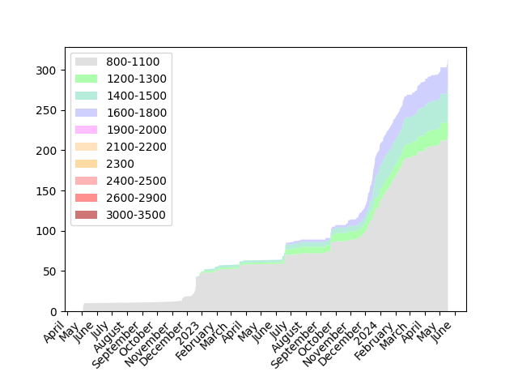

# Codeforces Archive
This is my [personal](https://github.com/D4NZ-jpg) archive of solutions to 
competitive programming problems on [Codeforces](https://codeforces.com). 

The primary goal of this repository is to help me track my progress and gather 
statistics from my performance in competitive programming. While it is 
initially set up for personal use, others are welcome to view it.

## Some cool graphs

## Structure

Here's a high-level view of the repository's organization:

- **Archive**: This directory contains all the problems I've solved. 
Each problem is saved as a separate file, with the problem's details added with
comments at the top of the file, including the problem's name and rating.

- **update.py**: A Python script responsible for adding the missing solutions 
to the Archive folder. 

- **Settings**: Contains the settings I use for my competitive programming 
environment and the default code template that I use for every problem.

## Usage

If you'd like to use this repository for your own Codeforces profile, follow 
these steps:

1. Fork the repository and clone it.
2. Delete all the files inside of `Archives` (make sure that the folder still
exists) and the `lock.json` file
3. Create a `.env` file at the root of the project, and add your Codeforces 
handle in the following format: `USER={CF HANDLE}`.
4. Run the `update.py` script. This will fetch the problems that you've solved 
and add them to the Archive folder.
5. Commit and push your changes to your fork

Make sure you have `clang-format` in your path

## Acknowledgement

If you find this repository helpful and decide to use it, an acknowledgement 
would be much appreciated, but it's not required.

---

Happy Coding!
